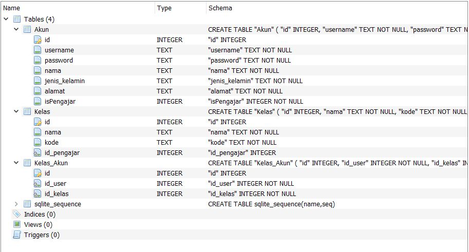
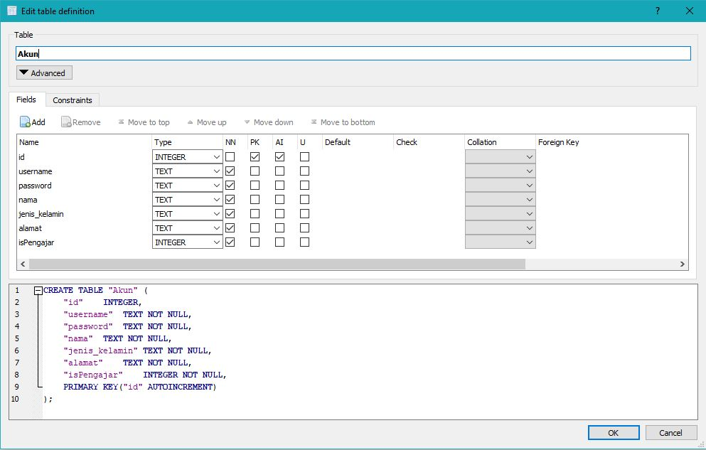
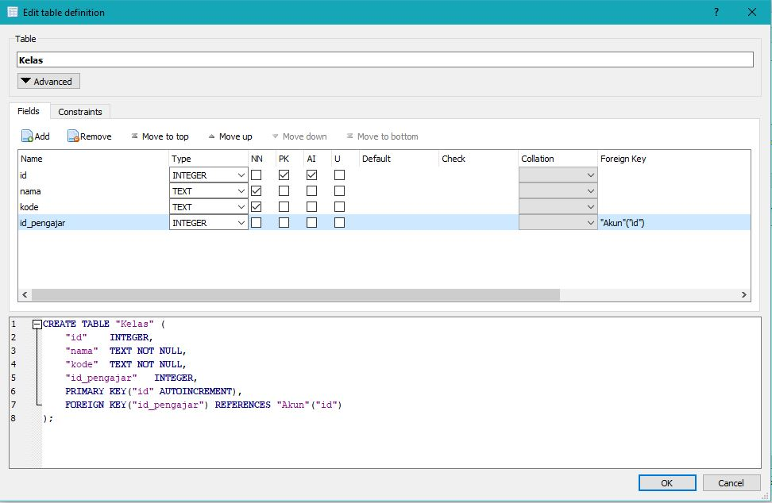
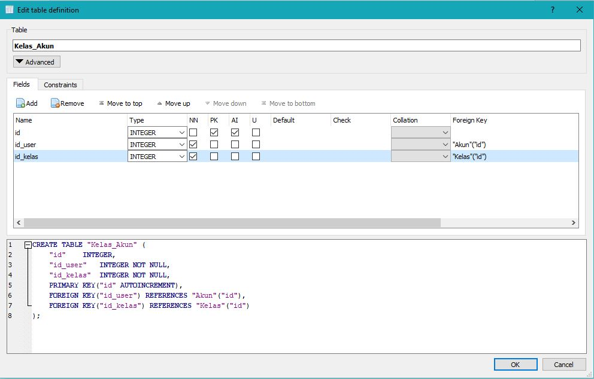

# E-Learning-Simple

## Pre-requirement
- DB Browser for SQLite (for management SQLite) [Link](https://sqlitebrowser.org/dl/)
- sqlite-jdbc-3.34.0.jar (Already exist in files)

## Add sqlite library to project

- Right Click on **Libraries** folder 
- Click on **Add JAR/Folder** and select `sqlite-jdbc-3.34.0.jar`
- Click open
- Done

## Database
### Table 

### Table Akun

### Table Kelas

### Table Kelas_Akun

## Query
- Select Kelas per akun:
`SELECT Kelas.id, Kelas.nama, Kelas.kode,Akun.id as id_pengajar, Akun.nama as pengajar FROM ((Kelas INNER JOIN Akun ON Kelas.id_pengajar = Akun.id) INNER JOIN Kelas_Akun ON Kelas_Akun.id_kelas = Kelas.id) WHERE Kelas_Akun.id_user = ?;`

- Select all kelas : 
`SELECT Kelas.id, Kelas.nama, Kelas.kode,Akun.id as id_pengajar, Akun.nama as pengajar FROM Kelas INNER JOIN Akun ON Kelas.id_pengajar = Akun.id;`

- Join kelas : 
`INSERT INTO Kelas_Akun (id_user,id_kelas) VALUES (?,?);`

- Delete kelas : 
`DELETE FROM Kelas_Akun WHERE id_user = ? AND id_kelas = ?;`

- Update kelas : 
`UPDATE Kelas SET nama=? WHERE id=?`

- Select all akun : 
`SELECT * FROM Akun`